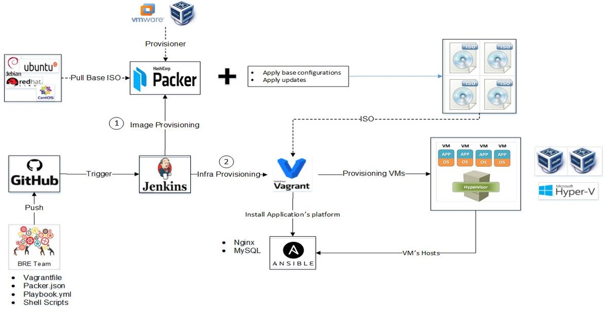

### Packer Example - Ubuntu 16.04 minimal Vagrant Box

**Current Ubuntu Version Used**: 16.04.2

**Pre-built Vagrant Box**:

This example build configuration installs and configures Ubuntu 16.04 x86_64 minimal using Packer, Ansible, and then generates two Vagrant box files, for:

  - VirtualBox

The example can be modified to use more Ansible roles, plays, and included playbooks to fully configure (or partially) configure a box file suitable for deployment for development environments.

## Goal
  - On Premise automated management of IT Infrastructure across organization 
  - Automaton of installation and configuration of infrastructure and provisioning environments like Oracle, Jboss, MS SQL, DB2, Apache   - using tools/frameworks.
  - Spin up environment dynamically 
  - On-Demand environment availability for applications on premise

## Requirements

The following software must be installed/present on your local machine before you can use Packer to build the Vagrant box file:

  - [Packer](http://www.packer.io/) - For creating identical machine images for multiple platforms from a single source configuration
  - [Vagrant](http://vagrantup.com/) – Building and managing virtual machine environments in a single & easy-to-use workflow.
  - [VirtualBox](https://www.virtualbox.org/) (if you want to build the VirtualBox box)
  - [VMware Fusion](http://www.vmware.com/products/fusion/) (or Workstation - if you want to build the VMware box)
  - [Ansible](http://docs.ansible.com/intro_installation.html) –  Applying configurations on Infrastructure configurations e.g.      installing My SQL, Apache/Nginx
  - [Jenkins] – To automate on premise infra provisioning
  - [GitHub] – Distributed Source control repository system
  - [Hyper – V] - Hypervisor allow for multiple virtual machines (VMs) to run on the same physical server. 
   

## Usage

Make sure all the required software (listed above) is installed, then cd to the directory containing this README.md file, and run:

    $ packer build ubuntu1604.json

After a few minutes, Packer should tell you the box was generated successfully.

## Testing built boxes

There's an included Vagrantfile that allows quick testing of the built Vagrant boxes. From this same directory, run one of the following commands after building the boxes:

    # For VirtualBox:
    $ vagrant up
    
## Use Cases
   - Spin up on-premise infrastructure specific to applications requirements.
   - Creating industry standard ISO files.
   - Creating MySQL VMs from ISO.
   - Creating Nginx VMs from ISO.
   - Deployment of Micro services based applications on newly built infra VMs

## Benefits

   - Speed & Agility
   - Increase in Productivity
   - Faster environment provisioning 
   - Image reusability
   - Centralized management
